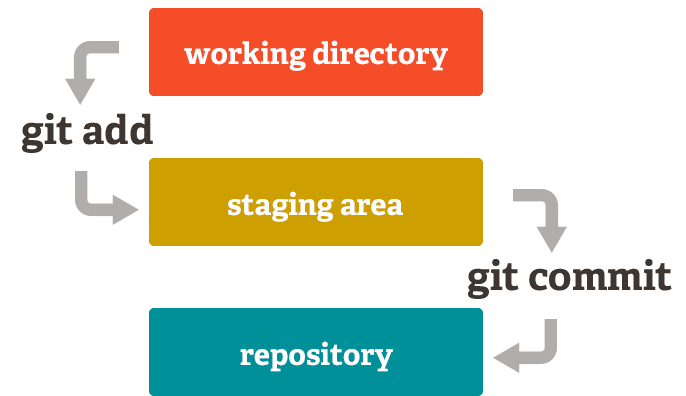

# Inleiding tot git

## *...met git op de command line en lokale repo*

**Nederlandse vertaling en toevoegingen**
Deze handleiding hoort bij Colt Steele's informatieve [YouTube video](https://www.youtube.com/watch?v=USjZcfj8yxE) (Steele, 2019). 

Dit is de vertaling van Steeles handleiding op [notion.so](http://notion.so) (Steele-b, 2019) voor gebruik in het I-Project 2020 van HAN AIM. Extra toevoegingen herken je aan het schaartje. Onderaan staat  nu ook een 'Bronnen' sectie volgens APA, zoals HAN studenten moeten hebben in eigen verslagen en rapporten.

Bart van der Wal - ***10-4-2020*** 

Afbeelding : Linus Torvalds gaf niet alleen Linux zijn naam, maar ook zijn versiebeheersysteem, omdat hij zichzelf (half grappend) als een 'git' ziet.

# 0. Inleiding

Git is een versiebeheersysteem *(version control system,* VCS).

Dat wil zeggen dat je hiermee wijzigingen (*changes*) aan projectbestanden bijhoudt over het verloop van de tijd. Dit maakt het mogelijk om op elk moment terug te gaan naar een specifieke versie van de bijgehouden bestanden (tracked files). Je kunt git gebruiken om  efficiënt **samen te werken aan een team project** met verschillende mensen**.** Iedere ontwikkelaar kan daarbij een eigen versie van het project op diens eigen computer hebben. Later kun je de individuele versies van het project samenvoegen (*mergen*) en de *hoofdversie* (master) van het project aanpassen.

Git is ook een 'gedistribueerd' versiebeheersysteem. Dit houd vooral in dat behalve de huidige code (versie) elke repository ook de volledige geschiedenis van alle versies lokaal heeft staan. Terwijl bij een gecentraliseerd VCS alleen een aangewezen centrale server deze meta informatie heeft (optioneel stuk hierover onderaan hoofdstuk 6).

Het komt er op neer dat git een enorm populaire tool is om het parallel werk te coördineren en projecten te beheren tussen individuen en teams. Het is onnodig om te zeggen dat het kunnen gebruiken van git tegenwoordig een van de belangrijkste vaardigheden is voor developers. Het is sowieso een geweldige toevoeging aan je CV!

Git officiele homepage: [https://git-scm.com/](https://git-scm.com/)

# 1. Setup instructies

Veel ontwikkelaars gebruiken git op de command-line. Deze benader je via je systeem *terminal*  (de zogenaamde *command line interface*, CLI). Hiervoor moet je eerst zorgen dat git geïnstalleerd staat op je computer.

Hier kun je git downloaden: [https://git-scm.com/downloads](https://git-scm.com/downloads)

Klik de download link voor jouw specifieke besturingssysteem en volg de stappen van de installatiewizard om alle dingen goed ingesteld te krijgen op je computer!

Start na het installeren je terminal en type het volgende commando om te controleren dat je git kunt gebruiken :

    git --version

Als de installatie goed ging, geeft dit commando het versienummer van git die op je computer geïnstalleerd staat.

Als je een Mac of Linux machine gebruikt kun je de default Bash terminal gebruiken die standaard al op je systeem staat.

Als je Windows gebruikt kun je de standaar Powershell terminal gebruiken, of de Git Bash terminal die gebundeld is met de git installatie. Voor gedetailleerde Windows Git and Git Bash installeer instructies, check deze blogpost: [https://zarkom.net/blogs/how-to-install-git-and-git-bash-on-windows-9140](https://zarkom.net/blogs/how-to-install-git-and-git-bash-on-windows-9140)

### Je gebruikersnaam en e-mail configureren

In je terminal, voer de volgende commando's uit om je git identiteit in te stellen:

    git config --global user.name "Je naam"
    git config --global user.email "jouw@email.nl"

Vervang hierbij de waardes tussen de quotes door je eigen naam en e-mail adres.

# 2. Repositories

Als je met git werkt is het belangrijk om bekend te zijn met de term **repository** (NL: 'opslagplaats'). Een *git* repository is een container voor een project die git bijhoudt (tracked).  

We kunnen twee hoofdtype repositories onderscheiden:

- **Local repository** - een geïsoleerde repository opgeslagen op je eigen computer, waar je op de lokale versie van je project kunt werken.
- **Remote repository** - over het algemeen opgeslagen buiten je geisoleerde lokale systeem, zoals op een extern systeem, bijvoorbeeld [github.com](http://github.com) . Dit is bijzonder nuttig als je in teams  wekt - dit is de plek waar je je project code kunt delen, de code van anderen kunt zien en code kunt integreren in jouw lokale versie van het project en ook jouw eigen wijzigingen kunt pushen (duwen/oversturen) naar de remote repository.

NB In zijn video, werkt Colt Steele alleen met een lokale repository.

# 3. Het initialiseren van een repository

Om een nieuwe repository te maken en te beginnen met het tracken van je project met Git, open je een terminal en navigeert naar de hoofd folder van je project (root folder), en typt dit commando:

    git init

Dit commando genereert een verborgen `.git` folder voor je project, waar `git` alle interne tracking data voor de huidige repository opslaat.

# 4. Stagen en committen van code

Committen is het proces waar je changes *'officieel'* toevoegt aan de git repository.

In Git, kun je **commits** zien als *checkpoints*, of *snapshots* van je project in zijn huidige toestand. Met andere woorden, we slaan de huidige versie van onze code op in een commit. Je kunt net zo veel commits maken als je wilt in de commit geschiedenis (history), en je kunt heen en weer gaan tussen verschillende commits om de verschillende *revisies* te zien van je code. Dit stelt je in staat om efficient je voortgang bij te houden en je project te tracken tijdens het ontwikkelen.

Commits maak je normaal op logische punten van het ontwikkelen van je project. Normaal gesproken na het toevoegen van specifieke inhoud, features of aanpassinge (zoals nieuwe functionaliteiten of bugfixes).

Voordat je je code kunt committen, moet je het in de de **staging area** zetten.

## 4.1. Checken van de status

Zolang je in je terminal in de project folder 'zit', kun je met het volgende commando de status van je repository bekijken:

    git status

Dit commando gebruik je heel vaak als je werkt met git. Het toont welke bestanden zijn aangepast, welke bestanden worden getracked, etc.

Op basis van de getoonde statusinformatie kun je makkelijk niet getrackte projectbestanden toevoegen in de **staging area** .

Als je na het toevoegen aan de staging omgeving  rapporteert `git status` elk wijziging die je gemaakt hebt aan de getrackte bestanden, voordat we beslissen om deze opnieuw aan de staging area toe te voegen.

## 4.2. Staging bestanden

In de project folder kun je het **git add** commando gebruiken om je bestanden toe te voegen aan de staging area, wat het mogelijk maakt dat git ze tracked.

Je voegt een specifiek  can bestand toe aan de staging area met het volgende commando:

    git add file.js

Meerdere bestanden tegelijk toevoegen doe je zo:

    git add file.js file2.js file3.js

In plaats van alle bestandsnamen los in te tikken is het ook mogelijk alle bestanden in de huidige folder (`.`) toe te voegen aan staging met:

    git add .

In deze staging area staan bestanden klaar en vanuit hier kun je ze committen en daarna zal git ze tracken.

**Chunk-based vs file-based**
Als je voor het eerst met git werkt is het wellicht apart dat hetzelfde bestand in het commit lijstje én in het untracked lijstje kan staan. Dit gebeurt als je een wijziging add naar staging en daarna verdere wijzigingen aan dit bestand aanbrengt. Dit voorbeeld laat zien dat git werkt met zogenaamde chunks. Dit zijn delen van bestanden,

## 4.3. Commits

Een **commit** is een snapshot van je code op een bepaald moment, die we opslaan in de *commit history* van je repository. Nadat je alle bestanden die je wilt tracken hebt toegevoegd met het `git add` commando, ben je klaar om een commit te maken.

Om de bestanden uit de staging area te committen gebruiken we het volgende command0:

    git commit -m "Commit bericht"

In de quotes geef je een **commit message** die gebruikt wordt om de commit te identificeren in de  *commit history*.

De commit message moet een beschrijvende samenvatting zijn van de wijzigingen die je commit.

Na het commando geeft git je de technische details in de terminal. En dat is het, je hebt je eerste succesvolle commit gedaan in je project!

Om een nieuwe commit te maken kun je een aantal keer het proces van bestanden toevoegen in de staging area herhalen en ze daarna te committen. Nogmaals, het is erg nuttig om tussendoor het **git status** commando te gebruiken om te zien welke bestanden *changed*, *staged*, of *untracked* zijn.

**Van working folder via staging area naar lokale repo** 
Onderstaand figuur geeft de flow *working directory* naar *staging* naar *(local) repository* weer. Het nut van de staging area is om hier een set van bij elkaar horende wijzigingen neer te zetten die je daarna samen commit. Pas daarbij geef je er een commit message bij en krijg je een commit hash.
Ander versiebeheersystemen hebben geen staging area, en je kunt er ook voor kiezen deze extra tussenstap over te slaan en gewoon alle openstaande wijzigingen direct van working directory naar 

Van workding dir via staging naar (Lucas Maurer, 2017)

**Once you commit, you can't loose s^%t ;)**
Als je iets hebt gecommit is het daarna safe en altijd terug te halen!

Als je bv. switcht van branch met ongecommitte wijzigingen, neemt git deze mee. Voordeel is dat je ze op deze branch kunt committen als ze daar meer thuishoren. Maar je kunt 'gedaan werk' zo ook kwijtraken als je rommelig werkt door gebrek aan tijd of git ervaring. Als bv. conflicten optreedt met bestaande wijzigingen op die branche

**Commit early and commit often!**
Commit daarom altijd VOOR grote git acties zoals switchen van branch, of synchroniseren met remote. Schrijf daarbij een korte maar duidelijke commit message (niet enkel '`changes`' oid)! Als je werk commit kan werk ook met weinig git ervaring nooit verloren, want met even puzzelen of ander erbij vragen kun het altijd terug halen. Dit doet git o.b.v.  de unieke *commit hash*. Jij als mens herkent de gewenste commit aan een (duidelijke) *commit message*.

## 4.4. Commit historie

Om alle gemaakte commits van een project te zien kun je het volgende commando gebruiken:

    git log

De logs tonen details voor elke commit, zoals de auteur, de gegenereerde hash van de commit, de datum en tijdstip van van de commit en de commit message.

Om terug te gaan naar een vorige staat van je project code gebruik je het volgende commando:

    git checkout <commit-hash>

Vervang `<commit-hash>` hierbij met de daadwerkelijke hash van de specifieke commit die je wilt bekijken, zoals gegeven via het `git log` commando.

Om terug te gaan naar de laatste commit (de nieuwste versie van je project code), gebruik je dit commando:

    git checkout master

## 4.5. Ignoren van bestanden

Om bestanden te negeren (ignore) waarvan je NIET wilt dat git deze bijhoudt (trackt) of toevoegt aan de staging area, maak een bestand met de naam `.gitignore` in hoofd project folder (het bestand staat dus direct in de root van de folder **naast** de verborgen `.git` folder).

In het `.gitignore` bestand zet je alle bestands- en foldernamen die je absoluut NIET wilt tracken . Zet elke 'ignored' bestand of folder op zijn eigen regel in het **.gitignore** bestand.

Je kunt een heel artikel lezen over *ignore* bestand [via deze link](https://help.github.com/en/articles/ignoring-files).

# 5. Branches

Je kunt een **branch** ('tak') interpreteren als een individuele timeline (tijdlijn) van je project commits. Met git kun je heel veel van deze alternatieve omgevingen maken (i.e. je kan verschillende **branches** maken), zodat er andere versies bestaan van ons project code die tegelijkertijd bijhoudt.

Dit stelt ons in staat om nieuwe (experimentele, onvoltooide, en mogelijke buggy) features in verschillende takken te hebben, zonder daarmee de '*officiële'* stabiele versie van onze project code te beïnvloeden (deze staat meestal op de **master** branch).

Als we een repository initialiseren, komen deze standaard in de **master** branch.

## 5.1. Een nieuwe branch maken

Je maakt een nieuwe branch met het volgende commando:

    git branch <new-branch-name>

De nieuwe branch die git aanmaakt is de referentie naar de huidige staat van je repository.

Het is een goed idee om een **development** branch aan te maken waar je werkt aan het verbeteren van je code, nieuwe experimentele features toevoegen en dergelijke. Als de ontwikkeling en het testen van deze features klaar is, en je ervoor gezorgd hebt dat er geen bugs meer zijn en de features gebruikt kunnen worden, kun je de wijzigingen in de **master** branch.

## 5.2. Veranderen naar een andere branche

Om te switchen naar een andere branch, gebruik je het **git checkout** commando:

    git checkout <branch-name>

Nu ben je op een andere geïsoleerde timeline van je project door van branch te wisselen.

Je werkt bijvoorbeeld aan verschillende features in je code en je hebt een aparte branch voor elk van deze features. Als je switched kun je wijzigingen committen die alleen die specifieke branch beïnvloeden. Je kunt dan switchen naar een andere branch om aan een andere feature te werken, die niet geraakt wordt door de wijzigingen en commits die je in de vorige branch maakte.

Om een nieuwe branch te maken, en er tegelijkertijd create a new branch and change to it at the same time, you can use the **-b** flag:

    git checkout -b <nieuwe-branch-naam>

Om de branches van je project op te vragen gebruik je het commando: `git branch`. De huidige branch is aangegeven met een sterretje.

    test$ git branch
      develop
    * master

Om terug te gaan naar de  **master** branch, gebruik je dit commando:

    git checkout master

## 5.3. Mergen van twee branches

Je kunt merges branches in situaties waar je code wijzigingen wil implementeren in een andere branch die je in een individuele branch hebt gemaakt.

Bijvoorbeeld als je met succes een nieuwe feature volledige hebt geïmplementeerd én getest in je eigen code, dan wil je deze *changes* mergen met een stabiele branch van je project (dit is meestal de default **master** branch).

Om deze changes van een andere branch in je huidige branch te mergen gebruik je dit commando:

    git merge <branch-naam>

Hierbij vervang je `<branch-naam>` met de naam van de branch die je wilt integreren in je huidige branch.

## 5.4. Verwijderen van een branch

Om een branch te verwijderen, kun je het commando **git branch** gebruiken met de  **-d** flag:

    git branch -d <branch-naam>

Lees meer over branchen en mergen [op deze link](https://git-scm.com/book/en/v2/Git-Branching-Basic-Branching-and-Merging) (Engels).

**Remote repo's en branches** 
Het werken met *remote repo* en *remote branches* behandelen we hier niet, maar moet je zelf uitzoeken (zie bron van github). Maar onthoud vast dat niet elke lokale branch ook per se een remote branch hoeft te hebben. De standaard naam voor de remote is `origin`. Ook deze heeft een `master` branch.

**Is het 'branch of 'branche'?**
Het Nederlandse woord branch**e** (met een 'e' op het eind) heeft een wat andere betekenis dan het Engelse 'branch' = tak. Een branche is een 'industrie' of ook wel 'groep van bedrijven' waar je in werkt, bijvoorbeeld 'automotive' of 'ICT'. Dit heet echter ook wel weer een 'bedrijfs**tak**'... Wij Nederlanders hebben dit woord (en betekenis) uit het Frans overgenomen, maar het git woord is dus 'branch' op z'n Engels uitgesproken in plaats van met de Franse (neus)klank :).

# 6. Verdere leermaterialen

Om meer over Git te leren, check de volgende bronnen:

- Git officiele documentatie: [https://git-scm.com/doc](https://git-scm.com/doc) (Engels)
- Het gratis **Pro Git** book: [https://git-scm.com/book/nl/v2](https://git-scm.com/book/en/v2) (deels Engels)
- Leer meer over GitHub: [https://guides.github.com/](https://guides.github.com/) (Engels)

GitHub is een website waar je repositories online kunt opslaan. Dus GitHub werkt samen met git als een hosting service voor remote repositories.

**Extra: Distributed vs centralized version systems (DVCS vs CVCS)**
git is een *gedistribueerd* VCS. De tegenpool hiervan een gedistribueerd VCS is een *gecentraliseerd* versiebeheersysteem. Concrete voorbeelden hiervan zijn *SVN* en *CVS*, Git is niet het enige gedistribueerde VCS, maar wel degene die de de leidende positie van CVS en later SVN heeft overgenomen. SVN kom je echter ook nog tegen op de HAN en in het bedrijfsleven. 

Veel principes achter versiebeheer zijn hetzelfde. Verschil van een gecentraliseerd systeem is wel dat er daar één repository of server de centrale bron waar de rest mee synchroniseert. Dit werkt voor gebruikers vrij intuïtief, en feitelijk vervult GitHub in veel git projecten gebruiken alsnog deze centrale rol. Deze rol is dan echter 'logisch' en niet 'fysiek'. Met git kun je makkelijk elke clone of fork van de voormalige centrale repo als nieuwe centrale repo gaan gebruiken.

Dus zelfs jouw eigen repo in je bestandssysteem. Elke repo is een backup van de code én complete historie, en je kunt er makkelijk op aansluiten. Zo kun je snel herstellenm bijvoorbeeld als:
- de hoofdserver cracht met kapotte harddisk
- de beheerder van een originele repo er geen tijd mee voor heeft
- als GitHub, of GitLab of nog een andere git provider de prijs verhoogt of andere ongewenste voorwaarden oplegt (wat ze dus ook niet zomaar zullen/kunnen doen)

## Bronnen

- Colt Steele (19-9-2019). *Learn Git In 15 Minutes*. Geraadpleegd op 10-4-2020 via  [https://www.youtube.com/watch?v=USjZcfj8yxE](https://www.youtube.com/watch?v=USjZcfj8yxE)
- Colt Steele (19-9-2019). *Introduction to Git.* Geraadpleegd op 10-4-2020 via [https://www.notion.so/Introduction-to-Git-ac396a0697704709a12b6a0e545db049](https://www.notion.so/Introduction-to-Git-ac396a0697704709a12b6a0e545db049#d5e9c2b6379246a593c1ef74051e7e3c)
- Lucas Maurer (10-10-2017). *Git Gud: The Working Tree, Staging Area, and Local Repo*. Geraadpleegd op 10-4-2020 via [https://medium.com/@lucasmaurer/git-gud-the-working-tree-staging-area-and-local-repo-a1f0f4822018](https://medium.com/@lucasmaurer/git-gud-the-working-tree-staging-area-and-local-repo-a1f0f4822018)
- GitHub (z.d.). *Configuring ignored files for a single repository*. Geraadpleegd op 10-4-2020 via [https://help.github.com/en/github/using-git/ignoring-files](https://help.github.com/en/github/using-git/ignoring-files)
- Scott Chacon, Jason Long et al. (z.d.). *Git SCM: Git Branching - Basic Branching and Merging*. Geraadpleegd op 10-4-2020 via [https://help.github.com/en/github/using-git/ignoring-files](https://help.github.com/en/github/using-git/ignoring-files)
- Stackoverflow.(10-3-2010). *How can I stage and commit all files, including newly added files, using a single command?* Geraadpleegd op 10-4-2020 via [https://stackoverflow.com/questions/2419249/how-can-i-stage-and-commit-all-files-including-newly-added-files-using-a-singl](https://stackoverflow.com/questions/2419249/how-can-i-stage-and-commit-all-files-including-newly-added-files-using-a-singl)