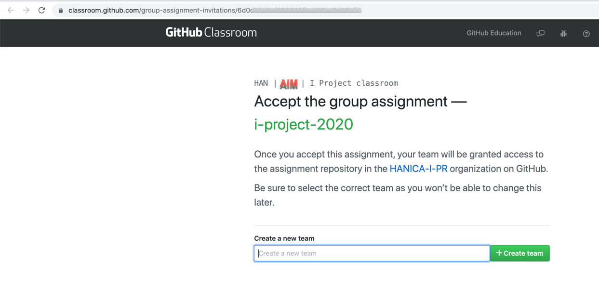
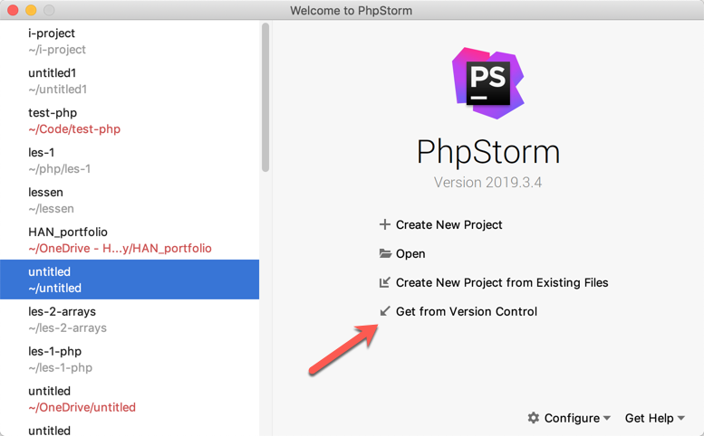
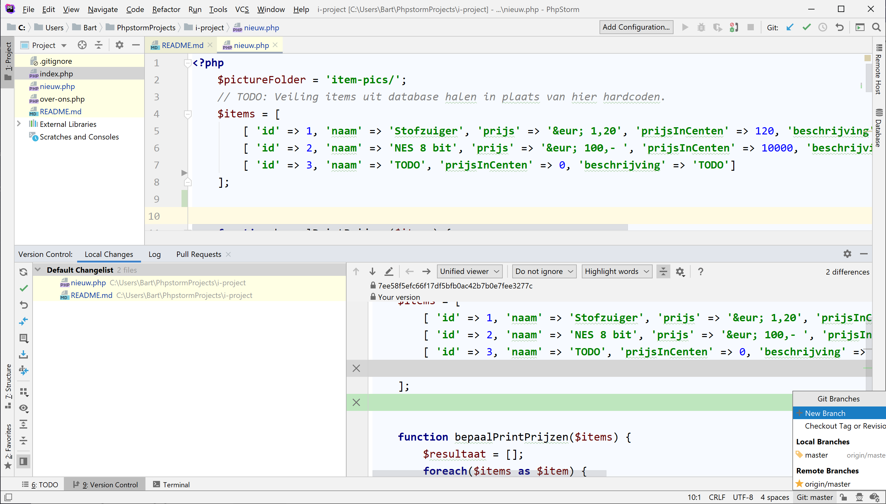

# Versiebeheer met git in het I-Project

### *...met PHPStorm IDE en remote repo aangemaakt door GitHub Classroom*

**Nederlandse vertaling en toevoegingen**
Deze git handleiding is een aanpassing van handleiding bij een YouTube video van Colt Steele (2019). Deze variant gebruikt PHPStorm's interne git Client in plaats van de git command line interface (CLI).
Er staat ook [een bijbehorende video op MS Teams](https://web.microsoftstream.com/video/5082a6f2-97a9-470f-acfa-5f1e03939aab).

Bart van der Wal - ***14-4-2020*** 

# 1. Inleiding

Git is een versiebeheersysteem *(version control system,* VCS).

Kortgezegd houdt een VCS wijzigingen (*changes*) aan projectbestanden bij over het verloop van de tijd. Met git kun je efficiënt **samenwerken aan een team project** met verschillende mensen**.** Iedere ontwikkelaar heeft een eigen versie van het project op zijn computer hebben en kan deze samenvoegen (*mergen*) met de *hoofdversie* (master) van het project. Een uitgebreidere inleiding staat in inleiding tot git voor een uitgebreidere inleiding. 

Het komt er op neer dat git een enorm populaire en belangrijke tool is om als developers te kennen.

Voor meer info over git is het goed de video van Colt Steele te kijken en te volgen en de bijbehorende handleiding. In plaats van git op de command line gebruikt deze tutorial. Daarnaast gaan we hier wel werken met een remote repository om met meerdere mensen samen te werken, wat Steele's tutorial buiten beschouwing laat.

De rest van deze tutorial is nog work in progress (refactoren van de andere), maar hieronder vast de hoofdstappen. Stap 4 is een opzet, hierin kun je t.z.t. je eigen 'flow' vinden, zie hoofdstuk 9.

## Hoofdstappen 'How to git through the I-Project'

1. Accepteer de GitHub Classroom (GHC) opdracht (via de link/URL in e-mail)
    - 1e student per team: nieuw team `i-project-<x>` aanmaken → GHC repo laten aanmaken
    - andere teamleden: aangemaakte team kiezen → je krijgt toegang tot dezelfde repo
2. Vanaf lokaal aansluiten op de remote repo (met PHPStorm)
3. Lokaal naast standaard `master` branch, een eigen branch aanmaken (bv. `feature-1` of `wim`)
4. Met je team iteratief coden/ontwikkelen 
    - Dit zijn 6 stappen, waarvan de 1e de kerntaak is, de rest is 'git overhead':

        A) Ontwikkel feature of fix bug en doe lokale commits ("Commit early, commit often!")

        B) Als alles klaar en getest is, merge eigen branch naar `master`

        C) Pull eventuele wijzigingen van anderen van de remote (los eventuele merge conflicts op)

        D) Als er iets was, (integratie)testen en debuggen op `master`

        E) Als alles klaar en getest is, push naar remote (`origin`)

        F) Terug naar `wim` branch of `feature-2` en stap A; volgende bugfix, feature, etc. 😀)

Stap 1: Accepteer de GitHub classroom opdracht, maak hierbij evt. GitHub account aan en log in in GiHub

Stap 2: Clone remote repo in PHPStorm via de remote URL uit stap 1 in, en stel GitHub account in PHPStorm

Stap 3&4: Voer git acties uit binnen PHPStorm via: VCS menu optie met 'git' submenu, snelmenu linksonder of branch menu rechtsonder

Git officiele homepage: [https://git-scm.com/](https://git-scm.com/)

# 2. Maken remote via GitHub classroom assignment

# 3. Remote repo clonen naar lokaal PHPStorm

Veel ontwikkelaars gebruiken git op de command-line. In plaats hiervan heeft PHPStorm ook een ingebouwde grafische Git Client. Download PHPStorm opnieuw als je deze verwijderd hebt na het vak WebTech. Voer je IntelliJ Academic license key in, voor extra features/Ultimate editie

Hier kun je PHPStorm downloaden: https://www.jetbrains.com/phpstorm/download/

## 3.1 Nieuw project 'get from version control'

## 3.2 Je GitHub account configureren in PHPStorm

TODO, verdere stappen uitwerken, zoals in video tutorial.

# 4. Nieuwe branch aanmaken en switchen

# 5. Committen

# 6. Switch terug naar master en mergen

# 7 Pullen en pushen code

# 8. Git ignore: Uitbreiden ivm db connectionstring

# 9. Vind beste git flow als team

Scrum is een Agile werkwijze. Onderdeel van Agile is ook het continue verbeteren. En het goed samenwerken en onderling communiceren als team. De 1e regel van het agile manifesto luidt: 

> Value individuals and interactions over processes and tools

Nu je git eenmaal kent moet je hier zelf met je team een goed werkbare situatie mee creeren. Voorkom je merge conflicts door actief in de gaten te houden welk teamlid met welke code bezig is, en dit te scheiden, of laat je merge conflicts gewoon ontstaan, en plan je tijd in deze te mergen. Natuurlijk kijk je naast eigen ervaringen ook naar best practices uit literatuur uit het werkveld (onderzoeksruimten 'workshop' en 'literatuur') van de ICT research methods (Bonestroo et al. 2018).

Een goed startpunt is het originele artikel over '[git flow](https://nvie.com/posts/a-successful-git-branching-model/)', een blogpost van de Nederlander (!) Vincent Driessen (Driessen, 2010). Maar check bijvoorbeeld ook de [GitHub workflow](https://guides.github.com/introduction/flow/) waar Driessen begin dit jaar (maart 2020) zelf naar verwees voor een simpelere flow die soms beter past bij Web projecten dan git flow. Wellicht is dit een aardig startpunt die je zelfs al in je PvA kunt opnemen. Of in de conclusie hiervan of persoonlijke reflectie hier kort iets over weergeven. Laat in je verslag ook blijken wat je onderweg hebt geleerd, en dat je kunt reflecteren en praten over je vak.

# 10. Verdere leermaterialen

Om meer over Git te leren, check de volgende bronnen:

- Git officiele documentatie: [https://git-scm.com/doc](https://git-scm.com/doc) (Engels)
- Het gratis **Pro Git** book: [https://git-scm.com/book/nl/v2](https://git-scm.com/book/en/v2) (deels Engels)
- Leer meer over GitHub: [https://guides.github.com/](https://guides.github.com/) (Engels)

GitHub is een website waar je repositories online kunt opslaan. Dus GitHub werkt samen met git als een hosting service voor remote repositories.

## Bronnen

- Colt Steele (19-9-2019). *Learn Git In 15 Minutes*. Geraadpleegd op 10-4-2020 via  [https://www.youtube.com/watch?v=USjZcfj8yxE](https://www.youtube.com/watch?v=USjZcfj8yxE)
- Colt Steele (19-9-2019). *Introduction to Git.* Geraadpleegd op 10-4-2020 via [https://www.notion.so/Introduction-to-Git-ac396a0697704709a12b6a0e545db049](https://www.notion.so/Introduction-to-Git-ac396a0697704709a12b6a0e545db049#d5e9c2b6379246a593c1ef74051e7e3c)
- Bonestroo, W.J., Meesters, M., Niels, R., Schagen, J.D., Henneke, L., Turnhout, K. van (2018): ICT Research Methods. HBO-i, Amsterdam. ISBN/EAN: 9990002067426. Geraadpleegd 13-4-2020 van [http://www.ictresearchmethods.nl/](http://www.ictresearchmethods.nl/)
- Driessen, V. (5-1-2010). *A successful Git branching model*, Geraadpleegd 13-4-2020 van [https://nvie.com/posts/a-successful-git-branching-model/](https://nvie.com/posts/a-successful-git-branching-model/)
- GitHub Guides (30-11-2017). *Understanding the GitHub flow* Geraadpleegd 13-4-2020 van [https://guides.github.com/introduction/flow/](https://guides.github.com/introduction/flow/)